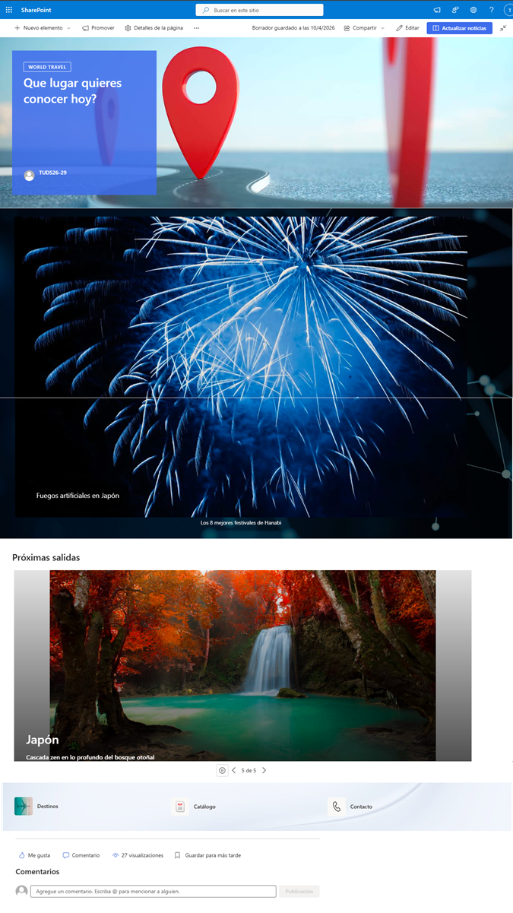
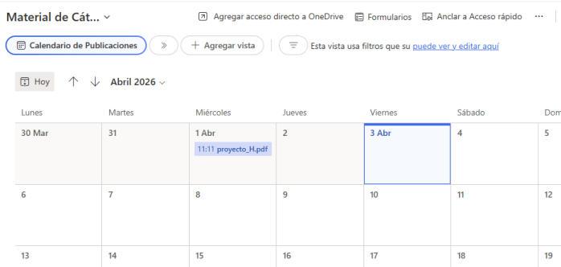
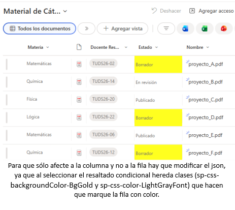

# Microsoft SharePoint Online

Implementación de distintas soluciones utilizando **Microsoft SharePoint Online**, aplicando gestión documental, organización de la información, metadatos administrados, permisos, vistas personalizadas, formato JSON y páginas modernas mediante diferentes escenarios de negocio.

---

# Descripción

Este repositorio reúne distintas implementaciones desarrolladas con **Microsoft SharePoint Online** para aplicar las principales funcionalidades de la plataforma en escenarios colaborativos.

Durante el desarrollo se trabajó con la creación de sitios y subsitios, bibliotecas de documentos, listas personalizadas, metadatos administrados, niveles de permisos, grupos de usuarios, vistas personalizadas, personalización mediante JSON y páginas modernas, utilizando diferentes casos de uso para demostrar las capacidades de SharePoint como plataforma de colaboración y gestión documental.

---

# Implementaciones realizadas

## Organización de sitios

- Creación de sitios y subsitios.
- Organización jerárquica del contenido.
- Configuración de navegación.

## Bibliotecas de documentos

- Bibliotecas personalizadas.
- Carpetas.
- Columnas adicionales.
- Gestión documental.

## Listas

- Listas personalizadas.
- Modelado de información.
- Relación entre datos.
- Organización mediante columnas.

## Metadatos administrados

- Creación de conjuntos de términos.
- Uso de Term Store.
- Clasificación mediante metadatos administrados.

## Gestión de permisos

- Creación de grupos.
- Asignación de permisos.
- Niveles de permisos personalizados.
- Administración de acceso según roles.

## Vistas

- Vista filtrada.
- Vista agrupada.
- Vista calendario.
- Vista predeterminada.

## Personalización

- Formato de columnas utilizando JSON.
- Resaltado condicional.
- Personalización visual de listas.

## Páginas modernas

- Diseño de páginas modernas.
- Integración de Web Parts.
- Documentos.
- Imágenes.
- Vínculos.
- Calendarios.
- Contenido colaborativo.

---

# Tecnologías utilizadas

- Microsoft SharePoint Online
- Microsoft 365
- SharePoint Lists
- Document Libraries
- Term Store
- JSON Column Formatting
- Modern Pages
- Web Parts

---

# Capturas

## Página moderna

## Vista calendario

## Formato de columnas con JSON

---

# Documentación

La documentación completa se encuentra disponible en:

**📄 documentacion/Documentacion.md**

---

# Conceptos aplicados

- Sitios y Subsitios.
- Bibliotecas de documentos.
- Listas de SharePoint.
- Columnas personalizadas.
- Metadatos administrados.
- Term Store.
- Permisos y grupos.
- Niveles de permisos personalizados.
- Vistas personalizadas.
- Formato JSON.
- Páginas modernas.
- Web Parts.
- Organización documental.
- Gestión colaborativa de información.

---

# Estado

Repositorio finalizado.

---

# Autor

**Andrea Natalia Tello**

- GitHub: [AnNaTe07](https://github.com/AnNaTe07)
- LinkedIn: [Andrea Natalia Tello](https://www.linkedin.com/in/andrea-natalia-tello-623874325/)
