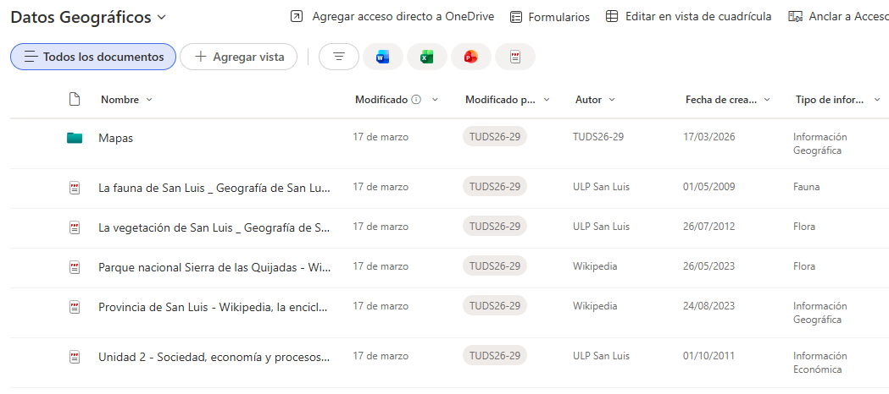
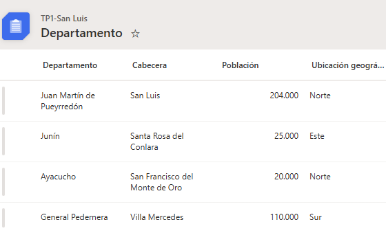
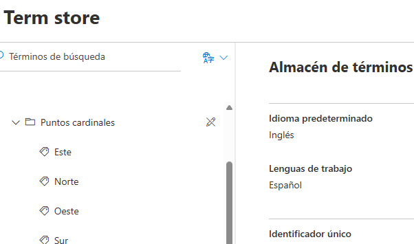
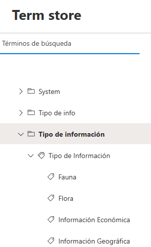
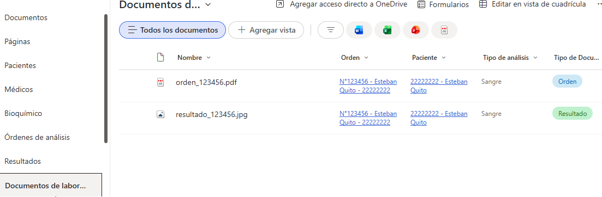
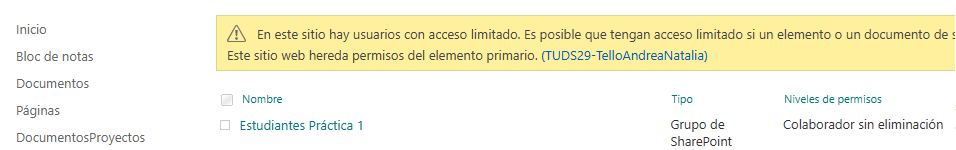
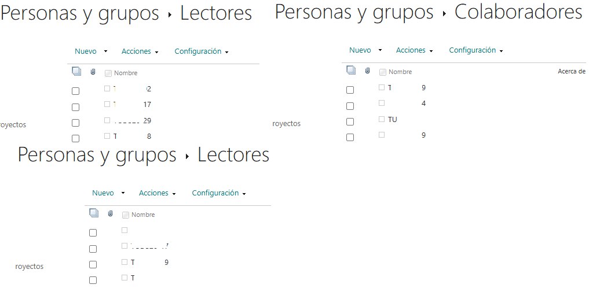
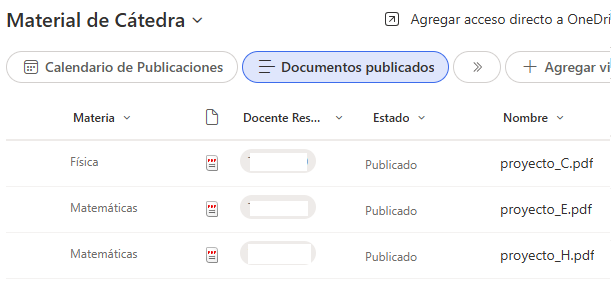
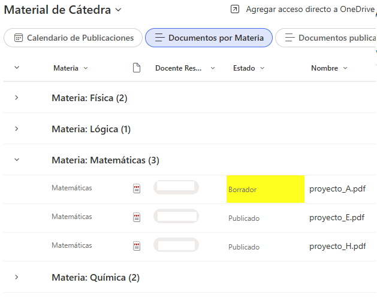

# Microsoft SharePoint Online


# Descripción

Este repositorio reúne distintas implementaciones desarrolladas con **Microsoft SharePoint Online**, aplicando las principales funcionalidades de la plataforma para la gestión documental, organización de la información y colaboración.

Durante el desarrollo se trabajó con la creación de sitios y subsitios, bibliotecas de documentos, listas personalizadas, metadatos administrados, permisos, grupos, vistas personalizadas, formato JSON y páginas modernas, utilizando distintos escenarios prácticos para aplicar las herramientas ofrecidas por SharePoint.

---

# Objetivos

Los desarrollos realizados tuvieron como finalidad aplicar los principales conceptos de Microsoft SharePoint Online mediante ejercicios prácticos.

Entre los objetivos alcanzados se encuentran:

- Crear sitios y subsitios.
- Administrar bibliotecas de documentos.
- Organizar información mediante listas.
- Utilizar metadatos administrados.
- Configurar permisos y grupos.
- Crear niveles de permisos personalizados.
- Implementar vistas personalizadas.
- Personalizar listas mediante JSON.
- Diseñar páginas modernas.
- Organizar contenido para trabajo colaborativo.

---

# Tecnologías utilizadas

| Tecnología | Función |
|------------|---------|
| Microsoft SharePoint Online | Plataforma de colaboración |
| Microsoft 365 | Entorno de trabajo |
| Document Libraries | Gestión documental |
| SharePoint Lists | Administración de información |
| Term Store | Metadatos administrados |
| JSON Column Formatting | Personalización visual |
| Modern Pages | Creación de páginas |
| Web Parts | Componentes de contenido |

---

# Arquitectura general

```text
Usuarios
      │
      ▼
Sitios y Subsitios
      │
      ▼
Bibliotecas de Documentos
      │
      ▼
Listas
      │
      ▼
Metadatos Administrados
      │
      ▼
Permisos y Grupos
      │
      ▼
Páginas Modernas
```

---

# Implementación 1 - Organización de Sitios

Se desarrolló una estructura de sitios utilizando SharePoint Online para organizar la información de manera jerárquica.

## Funcionalidades implementadas

- Creación de sitio principal.
- Creación de subsitios.
- Organización del contenido.
- Configuración de navegación.
- Compartición del sitio con distintos niveles de permisos.

---

# Implementación 2 - Bibliotecas de Documentos

Se implementaron bibliotecas para almacenar documentación y archivos relacionados con distintos escenarios.

## Funcionalidades implementadas

- Creación de bibliotecas.
- Organización mediante carpetas.
- Carga de documentos.
- Carga de imágenes.
- Creación de columnas personalizadas.
- Clasificación mediante metadatos.

---

# Implementación 3 - Listas

Se desarrollaron listas personalizadas para administrar información estructurada.

## Funcionalidades implementadas

- Creación de listas.
- Columnas de texto.
- Columnas numéricas.
- Columnas de fecha.
- Columnas de opción.
- Columnas de metadatos administrados.

---

# Implementación 4 - Metadatos Administrados

Se utilizó el **Term Store** para clasificar información mediante conjuntos de términos reutilizables.

## Funcionalidades implementadas

- Creación de grupos de términos.
- Creación de conjuntos de términos.
- Asociación de metadatos a listas.
- Asociación de metadatos a bibliotecas.
- Clasificación uniforme de la información.

---

# Implementación 5 - Modelado de Información

Se desarrolló un escenario de gestión para un laboratorio clínico utilizando listas relacionadas.

Las implementaciones contemplaron información correspondiente a:

- Pacientes.
- Bioquímicos.
- Médicos.
- Órdenes de análisis.
- Resultados de laboratorio.

El objetivo fue organizar la información de forma similar a un modelo relacional, aprovechando las capacidades de SharePoint para estructurar y relacionar datos mediante listas.

---

# Implementación 6 - Gestión de Permisos

Se configuraron distintos niveles de acceso para administrar la seguridad de los sitios y proteger la información según el rol de cada usuario.

## Funcionalidades implementadas

- Creación de grupos de SharePoint.
- Asignación de permisos mediante grupos.
- Configuración de permisos sobre bibliotecas.
- Aplicación del principio de mínimo privilegio.
- Administración de permisos heredados.

## Niveles de permisos

| Grupo | Nivel de permisos |
|--------|-------------------|
| Lectores | Lectura |
| Colaboradores | Contribución |
| Gestores | Permiso personalizado |
| Administradores | Control total |

Además, se implementó un nivel de permisos personalizado denominado **Colaborador sin eliminación**, permitiendo agregar y modificar contenido sin posibilidad de eliminar elementos.

---

# Implementación 7 - Vistas Personalizadas

Se configuraron distintas vistas para facilitar la organización y consulta de la información almacenada en SharePoint.

## Vistas implementadas

### Vista filtrada

Permite visualizar únicamente los documentos cuyo estado es **Publicado**.

### Vista agrupada

Organiza automáticamente la información agrupando los documentos según la materia correspondiente.

### Vista calendario

Presenta los documentos de acuerdo con su fecha de publicación utilizando el formato calendario.

### Vista predeterminada

Se configuró una vista personalizada como predeterminada para mejorar la experiencia de navegación.

---

# Implementación 8 - Personalización mediante JSON

Se utilizó el formato JSON para personalizar la visualización de columnas en listas de SharePoint.

## Funcionalidades implementadas

- Formato condicional.
- Resaltado visual de información.
- Personalización de columnas.
- Mejora de la legibilidad de los datos.

En particular, se configuró un formato condicional para resaltar únicamente la columna **Estado** cuando el valor corresponde a **Borrador**, evitando modificar el estilo completo de la fila.

---

# Implementación 9 - Páginas Modernas

Se desarrollaron distintas páginas utilizando la experiencia moderna de SharePoint.

## Página informativa

Se diseñó una página incorporando distintos elementos web como:

- Texto.
- Imágenes.
- Documentos.
- Vínculos.

## Página colaborativa

Se creó una página orientada al trabajo en equipo, incorporando:

- Calendario.
- Documentos compartidos.
- Recursos de apoyo.
- Organización mediante secciones.

## Página para evento

Se desarrolló una página destinada a difundir un evento académico utilizando:

- Banner principal.
- Información del evento.
- Programa en PDF.
- Mapa.
- Preguntas frecuentes.

---

# Capturas

## Biblioteca "Datos Geográficos"

Biblioteca utilizada para almacenar documentos, imágenes y carpetas relacionadas con información geográfica de la provincia.




## Lista "Departamentos"

Lista personalizada utilizada para registrar departamentos de la provincia incorporando metadatos administrados.




## Metadatos administrados

Conjunto de términos utilizado para clasificar la ubicación geográfica mediante el servicio Term Store.




## Clasificación documental

Conjunto de términos utilizado para clasificar la documentación almacenada en la biblioteca según su tipo de información.




## Modelado de la solución

Implementación de listas y bibliotecas para representar la gestión documental del Laboratorio del Hospital Buena Salud.




## Nivel de permisos personalizado

Creación del nivel de permisos "Colaborador sin eliminación", permitiendo agregar y editar elementos sin autorización para eliminarlos.




## Grupos de usuarios

Configuración de grupos de SharePoint con distintos niveles de acceso para aplicar el principio de mínimo privilegio.




## Vista filtrada

Vista configurada para mostrar únicamente los documentos publicados.




## Vista agrupada

Vista organizada por la columna Materia para facilitar la navegación entre documentos.




## Vista calendario

Vista configurada para visualizar los documentos según su fecha de publicación.


## Personalización mediante JSON

Aplicación de formato condicional utilizando JSON para resaltar visualmente el estado de los documentos.


## Página moderna

Página informativa desarrollada utilizando Web Parts, imágenes, documentos y vínculos.


---

# Conceptos aplicados

Durante las implementaciones se trabajó con los siguientes conceptos:

- Sitios y Subsitios.
- Bibliotecas de documentos.
- Listas.
- Columnas personalizadas.
- Metadatos administrados.
- Term Store.
- Permisos.
- Grupos.
- Niveles de permisos personalizados.
- Herencia de permisos.
- Vistas personalizadas.
- Formato JSON.
- Páginas modernas.
- Web Parts.
- Organización documental.
- Gestión colaborativa de información.

---

# Conclusión

Las implementaciones desarrolladas permitieron aplicar las principales funcionalidades de Microsoft SharePoint Online relacionadas con la administración de información, gestión documental y colaboración.

Durante los distintos ejercicios se trabajó con la creación de sitios, bibliotecas, listas, metadatos administrados, permisos, vistas personalizadas, formato JSON y páginas modernas, integrando herramientas de Microsoft 365 para construir soluciones organizadas, reutilizables y orientadas al trabajo colaborativo.
